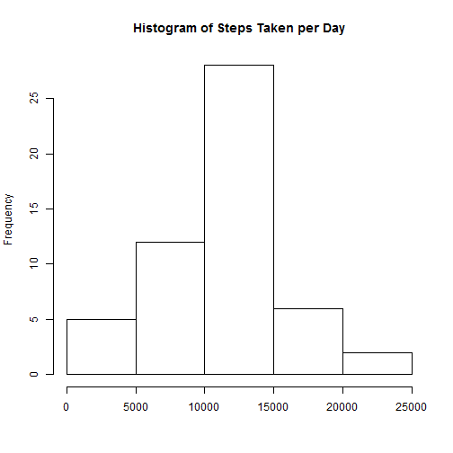
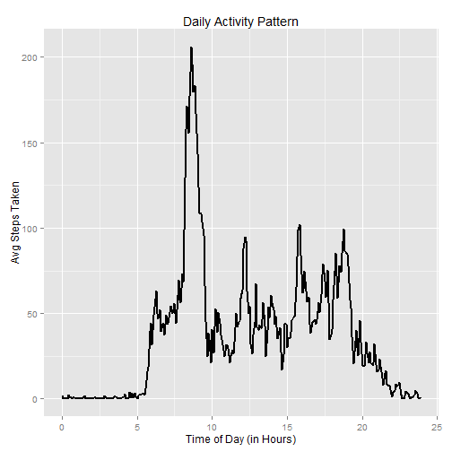
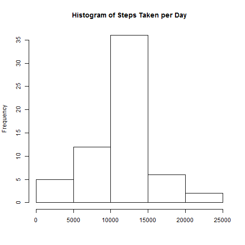
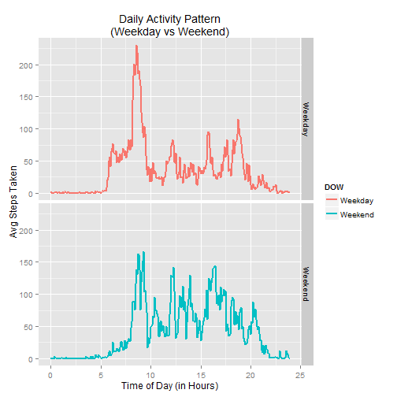

## Loading and preprocessing the data

```r
## Set the working directory
setwd("C:/Users/jlee/Documents/Data Science/Reproducible Research/")

## If the file isnt there, download it and unzip it
if (!file.exists("dataset.zip")) {
    url <- "https://d396qusza40orc.cloudfront.net/repdata%2Fdata%2Factivity.zip"
    download.file(url, dest="dataset.zip", mode="wb")
    unzip("dataset.zip")}

## Read into data frame.  Convert date to date format.
Activity <- read.csv("activity.csv")
Activity$date <- as.Date(Activity$date)

## Create new date variable in POSIX datetime format
fourchar <- sprintf("%04d", Activity$interval)
newdate <- strptime(paste(Activity$date,fourchar),"%Y-%m-%d %H%M")

## create new hour-of-the-day variable 
suppressWarnings(library(lubridate))
dayhours <- round(hour(newdate)+minute(newdate)/60,2)

##  Add 2 new variables to the dataframe
Activity <- cbind(Activity,newdate,dayhours)
```


## What is mean total number of steps taken per day?

```r
## Aggregate steps by day
stepsdaily <- setNames(aggregate(Activity$steps,list(date=Activity$date),sum),c("date","steps"))

## Create histogram
hist(stepsdaily$steps, main = "Histogram of Steps Taken per Day", xlab = "")
```

 

```r
##  Calculate mean and mediam across days
meansteps <- format(mean(stepsdaily$steps,na.rm=TRUE),scientific=FALSE)
mediansteps <- median(stepsdaily$steps,na.rm=TRUE)
```
The mean steps taken per day is 10766.19    
The median steps taken per day is 10765


## What is the average daily activity pattern?

```r
##  Calculate mean steps for each 5 minute intervals during the day, expressed in hours of the day
fivemin <- setNames(aggregate(Activity$steps,list(interval=Activity$dayhours),mean,na.rm=TRUE),c("dayhours","steps"))

## Generate the plot
suppressWarnings(library(ggplot2))
g <- ggplot(fivemin,aes(dayhours,steps))
q <- g + geom_line(lwd=1) + labs(y="Avg Steps Taken",x="Time of Day (in Hours)",title="Daily Activity Pattern")
q
```

 

```r
## Get the hour of the day when max occurs
themax <- fivemin[fivemin$steps == max(fivemin$steps),1]
```

The hour of the day with the maximum number of steps is at: 8.58 hours


## Imputing missing values

```r
totalna <- sum(is.na(Activity$steps))
```

There are 2304 observations/rows in the dataset with NAs step values


```r
## Create new dataframe and impute NA values, using mean of the 5-minute interval
Activity2 <- Activity
for (i in 1:nrow(Activity2)) {
    if (is.na(Activity2[i,1])) { 
        Activity2$steps[i] <- fivemin$steps[fivemin$dayhours == Activity2[i,5]]
        }
    }
## Aggregate steps by day
stepsdaily2 <- setNames(aggregate(Activity2$steps,list(date=Activity$date),sum),c("date","steps"))

## Create histogram
hist(stepsdaily2$steps, main = "Histogram of Steps Taken per Day", xlab = "")
```

 

```r
##  Calculate mean and mediam across days
meansteps2 <- format(mean(stepsdaily2$steps),scientific=FALSE)
mediansteps2 <- format(median(stepsdaily2$steps),scientific=FALSE)
```

With NAs filled, the mean steps taken per day is 10766.19.  This is about the same as previous result.  

With NAs filled, the median steps taken per day is 10766.19.  This is slighly different than previous result.  

Imputing missing data does not have a meaningful impact on the total number of steps per day.  


## Are there differences in activity patterns between weekdays and weekends?

```r
##  Create new dataset with Day of Week Variable starting with dataset with imputed values for NA steps
Activity3 <- cbind(Activity2,weekdays(Activity2$date))
colnames(Activity3)[6] <- "DOW"
Activity3$DOW <- as.character(Activity3$DOW)
for (i in 1:nrow(Activity3)) {
    if (Activity3[i,6] %in% c("Saturday","Sunday")) { 
        Activity3[i,6] <- "Weekend"
        }
    else {Activity3[i,6] <- "Weekday"}
}

##  Calculate mean steps for each 5 minute intervals in the day, expressed in hours of the day
fivemin2 <- setNames(aggregate(Activity3$steps,list(interval=Activity3$dayhours,dow=Activity3$DOW),mean),c("dayhours","DOW","steps"))

## Generate the plot
suppressWarnings(library(ggplot2))
g <- ggplot(fivemin2,aes(dayhours,steps))
q <- g + geom_line(aes(color=DOW),lwd=1) + labs(y="Avg Steps Taken",x="Time of Day (in Hours)",title="Daily Activity Pattern\n(Weekday vs Weekend)") + facet_grid(DOW ~.)
q
```

 

Activity pattterns differs between Weekday and Weekend days  
